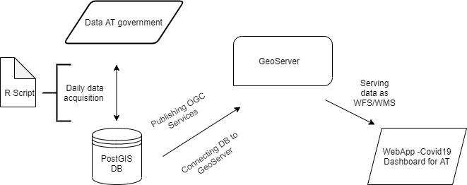

# COVID-19 Dashboard

The aim of the COVID-19 dashboard, developed by [Gil Salvans-Torras](https://www.linkedin.com/in/gil-salvans-torras-b4a231138/) and me, [Eike Blomeier](https://www.linkedin.com/in/eike-blomeier-224362200/), is to have a lightweight representation about the latest development of the COVID-19 situation.
The COVID-19 dashboard is combining different technologies to aggregate, store and publish the COVID-19 data. Also, several .js-libraries where used to build an interactive web-application. The following paragraphs containing detailed information about design decisions and implementations details. Figure 1 shows the used processes and technologies.

## Data scraping
To scrape the data from the [Austrian Open Data](https://www.data.gv.at/) portal a R script was developed. The R script scrapes the data from the portal, formats the data for the database, pushes the data into the database and sends a notification e-mail to the developers after. Table 1 contains the used libraries in the script while Table 2 displays the used data sources. To scrape the data on a daily base, the script runs on a Windows Server as a scheduled task every night at 00:30am.

| Library | Used for |
| ----------- | ----------- |
| RPostgreSQL | connecting to the PostgreSQL database |
| DBI | creating the database-driver   performing database operations|
| gmailr | Sending notification e-mail |

*Table 1 - Used libraries in R*

| Source | Content |
| ----------- | ----------- |
| https://covid19-dashboard.ages.at/data/CovidFaelle_Timeline_GKZ.csv | Timeline data for Covid-19 on district level |
| https://covid19-dashboard.ages.at/data/CovidFaelle_GKZ.csv | Today’s Covid-19 data on district level |

*Table 2 - Data sources*

## Data storing
To store the data, a PostgreSQL (PostGIS) DBMS is used. The used tables and their corresponding data are shown in Table 3. Indexes are used to enhance querying the tables (Table 4). Views are used to aggregate data from different tables into a single view (Table 5).

| Table | Data |
| ----------- | ----------- |
| austria_geoms | Contains the geometry information for the districts |
| covid19_austria | Contains the COVID-19 data |

*Table 3 - Database tables*

| Index | Index type | on table |
| ----------- | ----------- | ----------- |
| austria_gkz_btree_index | btree | covid19_austria |
| austria_id_btree_index | btree | austria_geoms |
| austria_time_btree_index | btree | covid19_austria |
| austria_geom_gist_index | gist | austria_geoms |

*Table 4 - Indexes*

| View | used tables | purpose |
| ----------- | ----------- | ----------- |
| austria_cases_today | austria_geoms   covid19_austria | Aggregates the today’s cases with their corresponding geometries |
| austria_gkz_timeline | covid19_austria | Creates a timeline for all the Austrian districts |
| austria_timeline | covid19_austria | Creates a timeline for Austria by aggregating the data for all districts |

*Table 5 - Views*

## Data publishing
GeoServer is used to publish the data from the database as OGC services. Table 6 shows the published services and the database sources. The styling has been carried out using SLD, which also generates a legend, published as WMS.

| Service | Type | Source |
| ----------- | ----------- | ----------- |
| austria_cases_today | WFS | austria_cases_today |
| austria_gkz_timeline | WFS | austria_gkz_timeline |
| austria_timeline | WFS | austria_timeline |

*Table 6 - GeoServer Services*

## Web-App
This part encompasses all the front-end work by creating an interactive dashboard web app to be served to everybody through the internet. To do so, the dashboard contains three parts: a web map, a table and time series charts. The web map displays the Covid-19 data regarding the seven days incidence (last 7 days new cases per 100.000 inhabitants) and by hovering with the mouse the user can also retrieve the total number of cases and the district name as popups. Regarding the table, it displays each district and new weekly cases with a search bar that enables personalized search. Additionally, the table can be sorted by any of its attributes. Finally, the time series chart presents the total number of infections since the first outbreak on a national scale by default, but when the user clicks on a specific district it changes to its district. The time series are also interactive in a way that the user can go through them to see each date and cases and also, there are multiple commands on top of the chart that the user can use; download chart, zoom in-out, pan, autoscaling, reset axes, show closest data on hover and compare data on hover. In agreement with this, these dashboard elements make it fully interactive and easy to use.
In technical terms, it has been developed by using NodeJS (JavaScript server-side runtime environment) and Parcel to bundle the web app. Therefore, it will be deployed on a production server from the university to guarantee a universal access via internet. Finally, the upcoming Table 7 specifies which libraries and node modules have been used.

| Library | used for |
| ----------- | ----------- |
| OpenLayers v.6.4.3 | Web Map development and geospatial matters |
| Ol-ext | Extension plugin of OpenLayers used for popups |
| Grid JS | Table elaboration |
| Plotly JS | Time-series charting |
| jQuery | JSON data handling (requested using AJAX) -> for non-geospatial matters (table & plots) |

*Table 7 - used JS libraries*

## Server
To serve the application as a Web-App, Apache Tomcat Server is used. The Web-App is deployed in the following domain: [human.zgis.at/coda](human.zgis.at/coda).

*Figure 1 - CODA workflow*

++UPDATE++\
Due to the official end of the COVID-19 pandemic, the hosting of the website was terminated. The used source-code alongside installing instructions can be requested [here](mailto:eike.blomeier@stud.plus.ac.at). The final version of the dashboard was capable to display the situation in Austria, Germany and Spain.

# Internship @ [Ocean Maps GmbH](https://www.ocean-maps.com/)

The internship took place from the 1st of July until the 31st of August 2022 at Ocean Maps GmbH. Ocean Maps is a globally operating, Salzburg based survey office specialized in hydrological surveys as well as merging point cloud data from different sensors in a single model.

During my internship, I gathered insights in the different fields Ocean Maps is dealing with. On the one hand, I was able to learn about how purpose-oriented research and testing is done, on the other hand I was taught about the full process of hydrological surveying. From gathering the data, to process it and what is important for the clients’ technical report.

One of my first tasks was to test an industrial camera by the Bavarian manufacturer SVS-Vistek. The goal was to figure out if the camera is suitable for mounting on a remote-controlled survey vessel, to combine the imagery with an already mounted laser scanner. During the testing phase, different tests were carried out to see how the camera is working in a stationary environment, how the camera is working in a moving environment and how customizable the camera is.
After getting familiar with the SVS-Visteks camera control tool SVCamKit, the first tests were carried out to see how the camera is working in a stationary environment and to get more familiar with the camera in general. The focus of the test was to see how realistic the colouring of the images is, how good the camera-focus and zoom works for different ranges from very short (~1m) to far away (~100m) and how well the camera works in different lighting conditions.
In the next phase, the camera was mounted on a movable tripod to see the cameras behaviour in a moving environment and pushed alongside similar structures like the camera was supposed to work with when mounted on the vessel. After this was repeated several times in different distances and lighting conditions, the pictures were analysed using the GIMP editor. In particular, the behaviour of the camera’s rolling shutter was to be analysed when the camera is moving while taking pictures.
Finally, I researched the manual of the camera to gain knowledge of the extensibility of the camera.
For my personal learning objectives, I learned about what are important features a camera should fulfil when being used on a moving platform as well as what are important camera specs when a camera must be used for professional, surveying tasks. Additionally, I learned about how a product testing is rolled out and what information is necessary to obtain and communicate with other persons in charge.

In the advanced phase of the internship, I gained insights into vessel based hydrological surveying. Experienced colleagues taught me the fundamentals of hydrological surveying. Here, three major points were important:
1.	On-site GPS calibration of the sonar system before the boat is put into the water. This was performed using a tachymeter to measure the positions of the GPS-antennas in the used coordinate system. Later, the measured positions were compared to the positions measured by the GPS antennas to proof the absolute accuracy of the system.
2.	Setting up a base-station. The base-station is needed in case of loosing the connection for RTC-data while surveying. For set up, the base-station can either be placed over an official marking or the positions is determined using a tachymeter and / or RTC. To guarantee a good satellite-lock, the base-station must be place in a location where it can’t tip over (e.g., by cattle or human) and the sky-view is optimal (no buildings or trees a blocking the sky).
3.	Surveying using the “iWBMS” sonar on a vessel. The iWBMS Multibeam Sonar is used for the hydrological surveying. It is capable to measure the bottom of a waterbody with a precision up to 2 cm. Here, I was taught how to operate the survey-vessel in order to achieve optimal results surveying the waterbody. Additionally, I learned about the fundamental physics for sonar-based measurements. One of the most important things for high-quality results is to know the current speed of sound in the water column, since it can change a lot depending on the temperature and floating sediments. Using no or not the right sound-profile can result in a depth-difference of centimetres.

During the final phase of my internship, the basics of hydrological data processing were shown to me. I learned about how to clean the previous surveyed data using BeamworkX AutoClean. This is important since the sonar data will contain noise which leads to a false model. Noise can come from several sources. The most popular one is the noise which is produced by the system itself when the angle of the backscatter is relatively horizontal. This data is useless and must be deleted from the dataset. Other noise, e.g., algae usually has to be deleted as well since they will affect the quality of the interpolation for a 3D-model. 