<!DOCTYPE html>
<html lang="en">
    
    <body>
<h1 style="text-align: center;">About me</h1>

    

        
        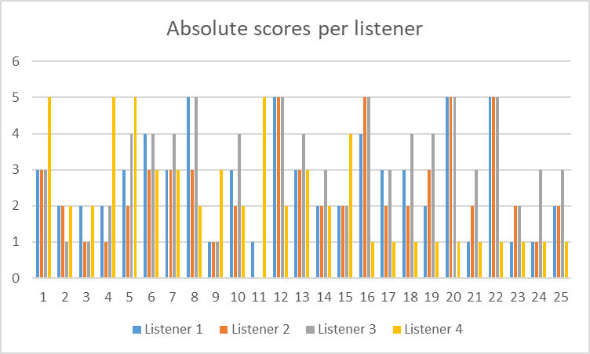
    

    

        
This ePortfolio gives an insight of my results I achieved during the M.Sc. Applied Geoinformatics program at Salzburg University as well as achievements at the Reykjavik University during my Erasmus. Feel free to contact me here:
              
            
            
        

    

 

<h1 style="text-align: center;"><strong>Master thesis</strong> The information flood: How to stay afloat
A Comparative Evaluation of Machine Learning Models for Relevance Classification of Flood-Related Tweets</h1>

<i>Abstract</i> 
Typically, during the early stages of a disaster, the amount of available and useful information is low. To fill this information gap, emergency responders are increasingly often using social media to gain insights from eyewitnesses to build a better understanding of the situation and design  effective responses. Recent developments like BERT have lifted NLP to the next level and successfully proven their capabilities in a wide range of NLP problems, outperforming previous state of the art methods. This work presents a comparison of BERT to different machine learning models for relevance classification tasks. Tweets are classified based on their relevance regarding flooding emergencies. Experts categorised Tweets to train the algorithms. Additionally, a prototype metric – called Gaussian score – is developed to overcome the issue of when misclassified data must to be treated differently.  A central limitation was the scarce number of German Tweets relating to a flooding event. Yet, the results look promising, scoring an average precision of 71% with most of the misclassifications happening between more similar classes.  
For the full thesis go <a href="https://github.com/fightingpilot/my.eportfolio.io/blob/main/documents/Masterarbeit_EikeBlomeier.pdf">here</a>.

 

<h1>Projects - Paris-Lodron University</h1>

    

        <h3 style="text-align: center;">CODA</h3>
        

        CODA stands for <i>COVID-19 Dashboard</i>. The aim of the COVID-19 dashboard, developed by
        <a href="https://www.linkedin.com/in/gil-salvans-torras-b4a231138/" target="_blank">Gil Salvans-Torras</a> and me, Eike Blomeier. This project consists of the development of a Spatial Data Infrastructure (SDI) with a thematical focus on the Covid19 pandemic in three countries: Austria, Germany, and Spain. In agreement with this, the infrastructure is continuously running and its data is updated in a daily basis automatically so the user can get a general understanding of the status of the pandemic in each of the aforementioned countries with the latest data through an interactive web application with different dashboards. To achieve this, this SDI can be divided in three stages. The first one, which regards to the daily data collection and setting it up into a geospatial database. Secondly, connecting the database to a GI Server to publish all the data as standard OGC services. Finally, a retrieval of the different services is carried out by the different dashboards of the web application. 
        For further readings and results of this project please klick <a href="https://github.com/fightingpilot/my.eportfolio.io/blob/main/documents/Blomeier_Salvans_CODA_FinalDocumentation.pdf" target="_blank">here</a>.
        

    

  

  

    </body>
</html>

# Designing an (Icelandic) TTS @ Reykjavik University

Text-to-Speech Synthesis is about to make computers read textual input out loud with a subgoal of making the computers voice sound as natural as possible. Since it’s difficult to create natural sounding human voice completely artificial, sentences must read by a person must be recorded and stored. While recording every word of a dictionary might be not an impossible but very time-consuming task, e.g., Icelandic contains about 43.000 words, English about 578.707, and German about 136.240 words  it will become a nearly impossible task if all possible alternations and pronunciations (e.g., end of sentence, end of question etc.) are considered. Additionally, if new words are added to a language, these words must be recorded and added to the system. Instead, by using phonemes, this issue can be overcome. Since phonemes, like letters, are appearing in words repeatedly. And different phonemes can be combined to different words of different length. Using this approach, a much smaller and more flexible search space must be recorded, which makes the TTS much more dynamic.
Still, some difficulties and challenges remain and must be overcome. Therefore, users of TTS created voice should carefully consider the use case (e.g., a bus stop announcing system, or a weather forecast system) and decide on a smart strategy on recording all the phonemes. While a human voice might not change a lot in a single conversation, it does on different days depending on multiple factors. This might result in a weird sounding computer generated voice. Additionally, it is probably not enough to have a single recording of each phoneme but multiple are needed since a phoneme can be pronounced slightly different depending on its appearance within a word or sentence as well as previous and subsequent phonemes.

## Festival
Festival is a multi-language building speech synthesis system. It is developed and released by “The Centre for Speech Technology Research” of the University of Edinburgh under the X11-type license. It allows users to use pre-recorded as well as self-recorded audios to create and train an own TTS. Using a modular design and different waveform synthesizers, allowing the user to modify and personalize to achieve a best fitting model depending on the users usecase.

## Unit Selection
Unit Selection selects a phoneme based on the previous and following phoneme. For all the possible phoneme combinations, a cost function is used to rate the combination of the phonemes. Finally, the best ranked combination of phonemes will be picked and used to create the audio. To save computations, unit selection will concatenate costs for subsets into the total costs.

## Clustergen TTS
Compared to Unit Selection, a Clustergen TTS uses a predictive approach to pick the most fitting utterances. Therefore, the input data will vectorized every defined timespan. These vectors are used to build a tree, minimizing impurity as well as train an HMM used to predict the most fitting phonemes.

## Experimental Setup
To create an own TTS using Festival, training data must be generated at first. Therefore, a set of pre-recorded Icelandic sentences of different length and content where used. Out of this set, a subset of 500 sentences was picked to train the unit selection model in Festival.

### Script Design
To pick the right 500 sentences out of the set of pre-recorded audios, the following steps where performed:
1.	Loading the dataset into two dictionaries (diphones, sentences)
2.	Computing a sentence score for each sentence
3.	Picking the sentence with the highest score
4.	Remove the sentence from the sentences dictionary
5.	Remove the diphones from the picked sentence out of the diphones dictionary
6.	Remove the diphones from all sentences containing the diphones
7.	Update the sentence scores
8.	Repeat steps 3-7 until 500 sentences are selected
The sentence score was computed as follows:
If the sentence didn’t contain any new diphones anymore, the score was set to zero. Otherwise, following formula was used:
$$ score = {NumberOfDiphonesInSentence \over NumberOfUnusedDiphones} + {1 \over NumberOfSymbolsInSentence} + {NumberOfDiphonesInSentence \over NumberOfSymbolsInSentence}$$

### The dataset
For the dataset, a given pre-recorded (male) dataset, containing 4731 recordings, was used. This dataset then was sliced down to 500 audios using the steps from explained above. Afterwards, the selected 500 audios were trimmed to remove pauses in the beginning and the end of the audio file. To archive this, the Librosa library was used. Trimming was performed manually. This means, five random audios were picked and trimmed using different frequencies and 55db were chosen to be the most suitable frequency to use for trimming. It is not cutting of valuable parts of the audio but still sensible enough to ignore disturbances in the beginning and end of the audio file. A sample can be seen in Figure 1 below.
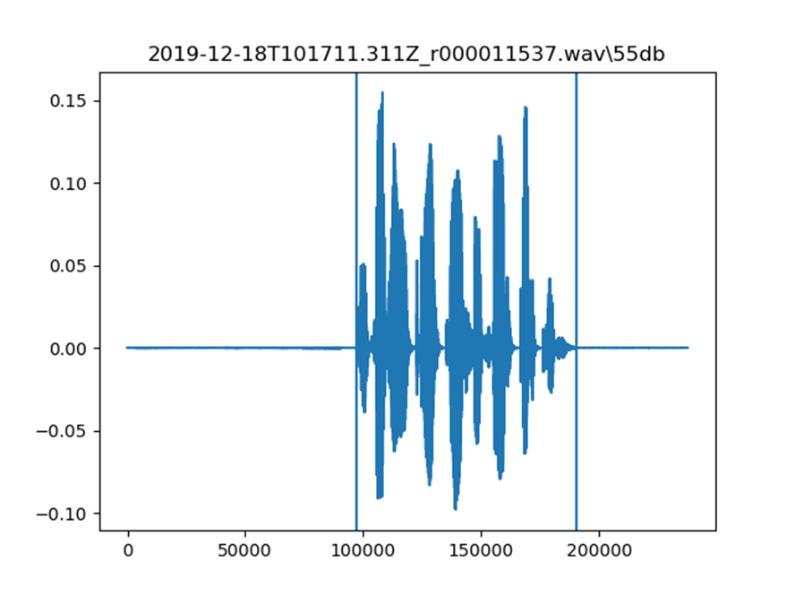
*Figure 1 - Trimming using 55db (sample)*

### Unit selection in Festival
The following steps are performed, using Unit Selection in Festival:
1.	Load the prepared training data into the environment
2.	Download the pre-build model into the environment
3.	Copy build-unit-selection.sh into the environment
4.	Change the VOX parameter to use own data
5.	Run build-unit-selection.sh
6.	Create text-file containing example sentences to build
7.	Create example outputs by running add_to_lexicon.sh and synth_file.sh

### Clustergen in Festival
The following steps are performed, using Clustergen in Festival:
1.	Make a copy of build-voice.sh (custom-build-voice.sh)
2.	Delete unnecessary parts of the script
3.	Change the VOX value to use own data
4.	Change the number of values to train on to dynamically use all the audios
5.	Run custom-build-voice.sh
6.	Create text-file containing example sentences to build
7.	Create example outputs by running add_to_lexicon.sh and synth_files.sh

## Results
### Script design
The main goal of the script I designed is to achieve a high coverage while keeping the sentences to read of a minimum length. This is done, to exculpate the reader from the difficulty of reading and recording long sentences with a minimum of variations in the reader’s voice. Following this idea, a total coverage score of 0.8239 is accomplished. The following figures a showing the sentence length compared to the covered (new) diphones (Figure 2) and the score values for the sentences (Figure 3).
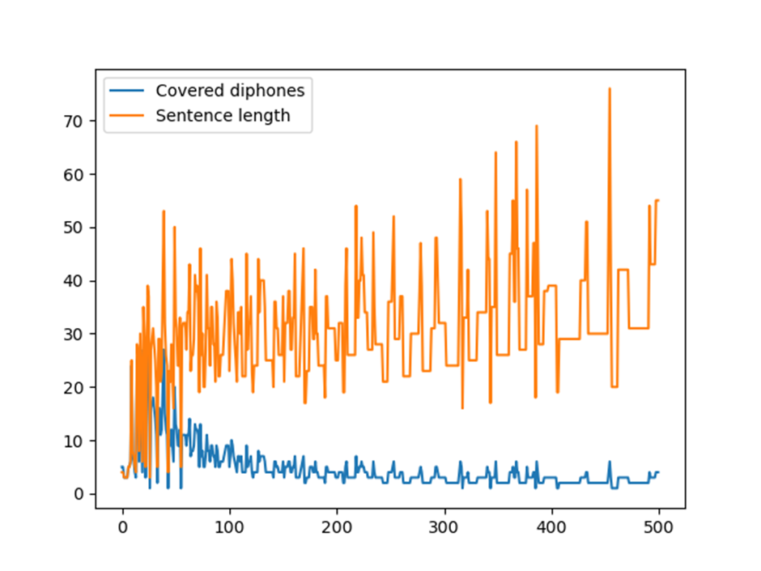
*Figure 2 - Covered diphones vs. Sentence length*

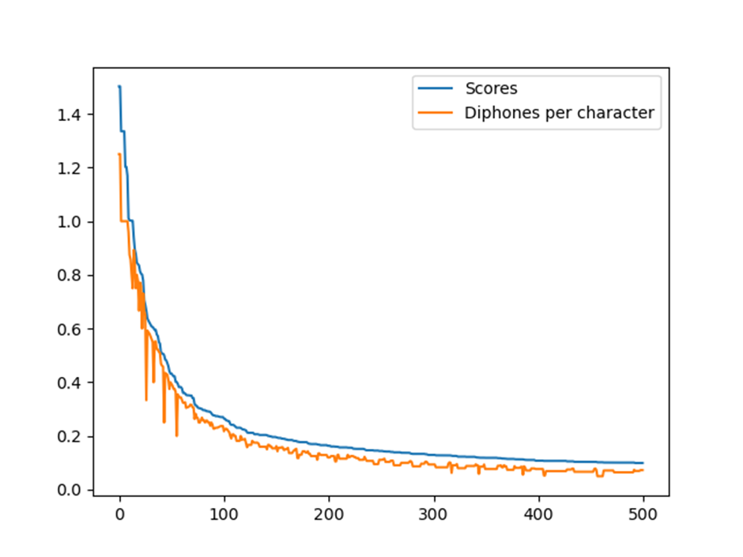
*Figure 3 - Scores and diphones per character*

### The dataset
To create the dataset which will be used in the upcoming TTS creation, a subset of 500 sentences were taken from a dataset of almost 5000 pre-recorded sentences. Figure 4 shows the total amount of tokens compared to the recording duration of each sentence.
Since the recording at some silent parts in the beginning and the end, each recording must have been trimmed to remove the silent parts. This was done in a manual way with a frequency value of 55 db. Further explanation on this decision is explained in Experimental Setup. Table 1 is showing the trimming results on example recordings.

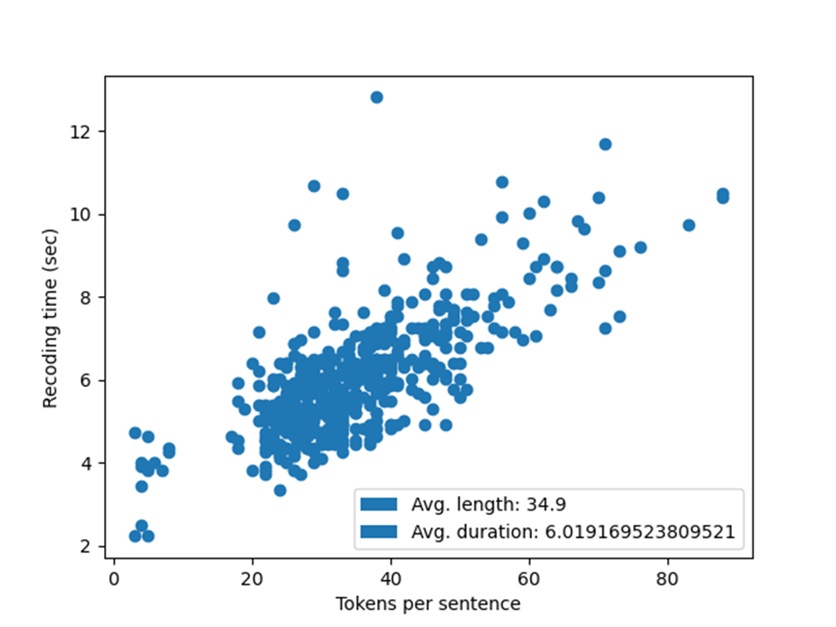
*Figure 4 - Token-duration scatterplot*

| db50 | db55 | db60 |
| ----------- | ----------- | ----------- |
| |  |  |
|  | 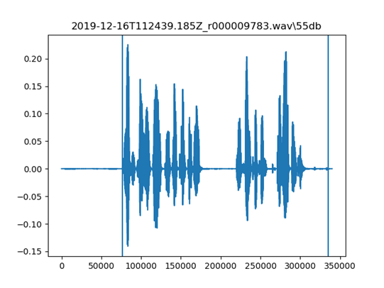 | 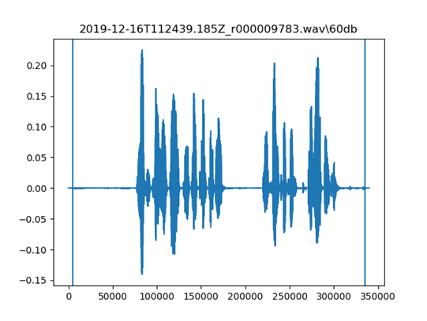 |
|  | 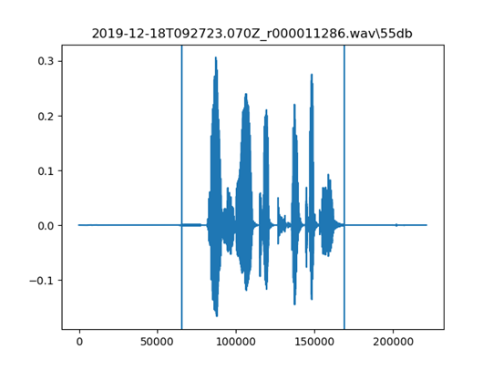 |  |
| 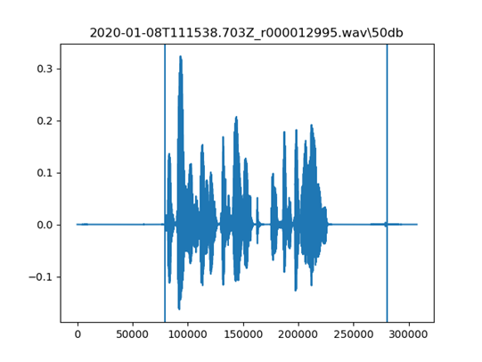 |  | 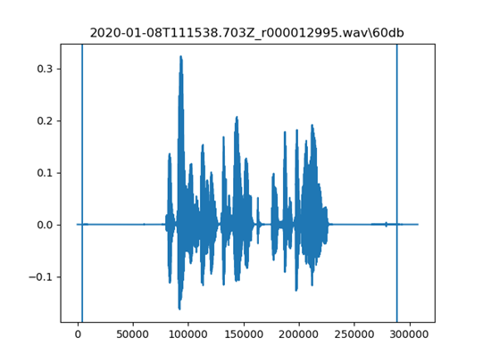 |

### MOS
The following figures are showing some descriptive statistics on the output of the Festival TTS. Figure 5 is showing the average MOS for each sentence. Figure 6 displays the total number of responses for each possible score value [1-5], and Figure 7 is representing the score for each sentence by every participant of the survey. It is quite interesting to see that listener number 4 looks like an outlier. This is something what must be considered on the evaluation of the MOS, since the total number of participants is low (4) and possible 25% of the total responses are corrupted and not usable.
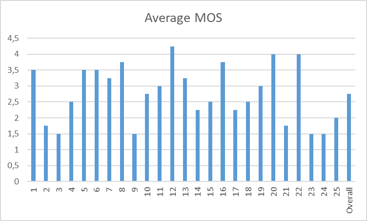
*Figure 5 - Average MOS per sentence and overall*

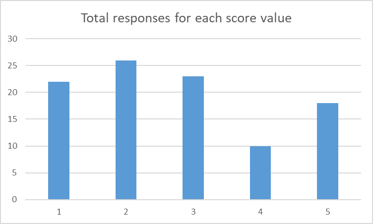
*Figure 6 - Total responses for each score value*

*Figure 7 -Absolute scores per listener and sentence*

Finally, the two different Festival TTS models are performing very different regarding their naturality. As the author doesn’t speak Icelandic he can only rely on the sound and not what is said. The main difference here is that the Unit Selection Voice has a more natural sounding, while the clustergen voice sounds more electronical and disturbed.

## Conclusions
In the authors opinion, the unit selection models sounds more natural compared to the more electronic and disturbed voice of the clustergen model. Both models were trained on 500 sentences, but the clustergen voice used a given model to train with the 500 sentences. This is a fairly low amount of data, compared to all the possible sentences and diphone combinations. Regarding to that, models could be improved by increasing the amount of training data on the one hand. On the other hand, it could be more useful to think of the use case for the TTS. E.g., a TTS what is designed to call out train connections in train stations probably won’t need to call out weather forecasts and vice versa. This could improve the use-case result significantly. Additionally, this TTS was tested under the best possible conditions (headphones, no noise from the outside) while in reality, these conditions are rarely given and the TTS should better be tested in places where it will be used in the future.

# Internship @ [Ocean Maps GmbH](https://www.ocean-maps.com/)

The internship took place from the 1st of July until the 31st of August 2022 at Ocean Maps GmbH. Ocean Maps is a globally operating, Salzburg based survey office specialized in hydrological surveys as well as merging point cloud data from different sensors in a single model.

During my internship, I gathered insights in the different fields Ocean Maps is dealing with. On the one hand, I was able to learn about how purpose-oriented research and testing is done, on the other hand I was taught about the full process of hydrological surveying. From gathering the data, to process it and what is important for the clients’ technical report.

One of my first tasks was to test an industrial camera by the Bavarian manufacturer SVS-Vistek. The goal was to figure out if the camera is suitable for mounting on a remote-controlled survey vessel, to combine the imagery with an already mounted laser scanner. During the testing phase, different tests were carried out to see how the camera is working in a stationary environment, how the camera is working in a moving environment and how customizable the camera is.
After getting familiar with the SVS-Visteks camera control tool SVCamKit, the first tests were carried out to see how the camera is working in a stationary environment and to get more familiar with the camera in general. The focus of the test was to see how realistic the colouring of the images is, how good the camera-focus and zoom works for different ranges from very short (~1m) to far away (~100m) and how well the camera works in different lighting conditions.
In the next phase, the camera was mounted on a movable tripod to see the cameras behaviour in a moving environment and pushed alongside similar structures like the camera was supposed to work with when mounted on the vessel. After this was repeated several times in different distances and lighting conditions, the pictures were analysed using the GIMP editor. In particular, the behaviour of the camera’s rolling shutter was to be analysed when the camera is moving while taking pictures.
Finally, I researched the manual of the camera to gain knowledge of the extensibility of the camera.
For my personal learning objectives, I learned about what are important features a camera should fulfil when being used on a moving platform as well as what are important camera specs when a camera must be used for professional, surveying tasks. Additionally, I learned about how a product testing is rolled out and what information is necessary to obtain and communicate with other persons in charge.

In the advanced phase of the internship, I gained insights into vessel based hydrological surveying. Experienced colleagues taught me the fundamentals of hydrological surveying. Here, three major points were important:
1.	On-site GPS calibration of the sonar system before the boat is put into the water. This was performed using a tachymeter to measure the positions of the GPS-antennas in the used coordinate system. Later, the measured positions were compared to the positions measured by the GPS antennas to proof the absolute accuracy of the system.
2.	Setting up a base-station. The base-station is needed in case of loosing the connection for RTC-data while surveying. For set up, the base-station can either be placed over an official marking or the positions is determined using a tachymeter and / or RTC. To guarantee a good satellite-lock, the base-station must be place in a location where it can’t tip over (e.g., by cattle or human) and the sky-view is optimal (no buildings or trees a blocking the sky).
3.	Surveying using the “iWBMS” sonar on a vessel. The iWBMS Multibeam Sonar is used for the hydrological surveying. It is capable to measure the bottom of a waterbody with a precision up to 2 cm. Here, I was taught how to operate the survey-vessel in order to achieve optimal results surveying the waterbody. Additionally, I learned about the fundamental physics for sonar-based measurements. One of the most important things for high-quality results is to know the current speed of sound in the water column, since it can change a lot depending on the temperature and floating sediments. Using no or not the right sound-profile can result in a depth-difference of centimetres.

During the final phase of my internship, the basics of hydrological data processing were shown to me. I learned about how to clean the previous surveyed data using BeamworkX AutoClean. This is important since the sonar data will contain noise which leads to a false model. Noise can come from several sources. The most popular one is the noise which is produced by the system itself when the angle of the backscatter is relatively horizontal. This data is useless and must be deleted from the dataset. Other noise, e.g., algae usually has to be deleted as well since they will affect the quality of the interpolation for a 3D-model.